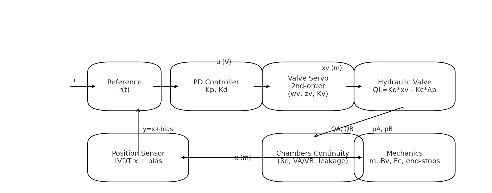

# PFCA: Hydro-Mechanical Primary Flight Control Actuator (MATLAB + Simulink)

PFCA (EHSV + cylinder + inner-loop control).



## Repository Structure
```
pfca/ 
├─ matlab/
│  ├─ src/                 # Nonlinear model & utilities
│  └─ examples/            # Ready-to-run scripts (step, faults, FRF)
├─ simulink/
│  ├─ build_pfca_lti_simulink_model.m  # Auto-build State-Space Simulink model
│  └─ run_simulink_lti_step.m          # Simulate the LTI model
├─ docs/
│  ├─ theory/              # Modeling notes with equations
│  └─ figures/             # Diagrams and visuals
├─ .gitignore
├─ LICENSE
└─ README.md
```

## Step-by-Step Plan

**Step 1 — Theory (Docs):** See `docs/theory/01_modeling_theory.md` and the block diagram.

**Step 2 — Nonlinear MATLAB Model:** Use `matlab/src/*.m`:
- `pfca_params.m`, `pfca_ode.m`, `pfca_controller.m`.
- Run examples:
  ```matlab
  addpath matlab/src matlab/examples
  out = run_pfca_nominal();  plot_pfca(out);
  outf = run_pfca_faults();  plot_pfca(outf);
  ```

**Step 3 — LTI Linearization + Simulink:** 
- Build A,B,C,D numerically: `linearize_pfca_numerical.m`.
- Auto-build a Simulink model with a **State-Space** plant and PD controller:
  ```matlab
  addpath matlab/src simulink
  build_pfca_lti_simulink_model;   % creates pfca_lti_model.slx
  run_simulink_lti_step;           % runs a step test
  ```

**Step 4 — Verification Scripts (FRF, Metrics):**
- `compute_metrics.m` for rise/overshoot/settling.
- `frf_chirp.m` to estimate inner-loop FRF vs. the ≥20 Hz / ≥50° targets.
*(Included in `matlab/examples`)*

**Step 5 — Fault Injection & Detection:**
- Use `run_pfca_faults.m` and add detection logic to measure detection times, evidencing PFCA-S02.

**Step 6 — Reporting:**
- Export plots to `docs/figures/` and paste key results in your Overleaf SRS/VCRM.

## Quick Start
```matlab
% From repo root:
addpath matlab/src matlab/examples simulink
out = run_pfca_nominal();    plot_pfca(out);
build_pfca_lti_simulink_model;
run_simulink_lti_step;
```

## Push to GitHub
```bash
git init
git add .
git commit -m "PFCA-Pro initial commit: MATLAB+Simulink model, theory, visuals"
git branch -M main
git remote add origin https://github.com/<yourname>/pfca-pro.git
git push -u origin main
```

## License
MIT — see `LICENSE`.
